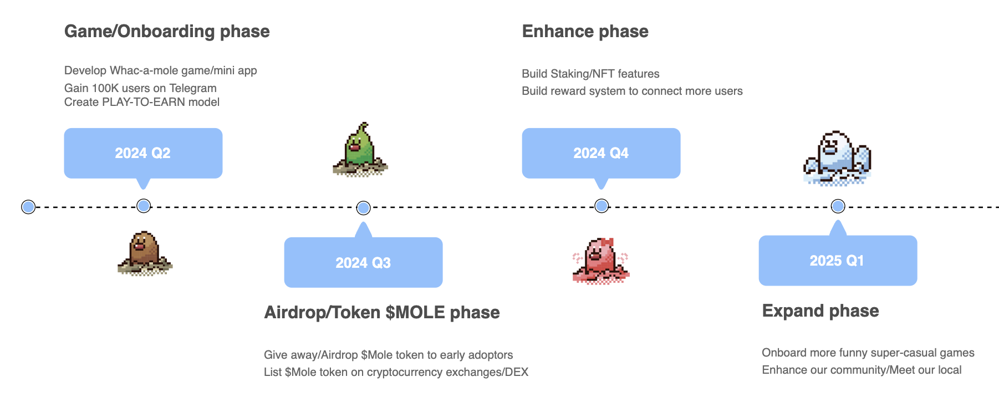

# Molevese

## vision

Build super funny/simple play-to-earn game and make people earn real asset instantly

## description

Based on TON&Telegram ecosystem, we build a simple whac-a-mole game via Teligram Mini App - Moleverse. In Moleverse, user can simply click/whac moles and then get rewards. The rewards are real asset on TON, like USDT/TON coin/other meme coin on TON as well as our native token. The reward will be arranged as airdrop round by round. For example, on mint phase, we will some deposit assets(TON/USDT/MOLE) first, when user reach a new level or at a specific moment, user will hit the asset just like easter egg and get them.

More than that, as play-to-earn game, we love to share with friends. We build a feature that user can pack gifts in a box and send to friends. As the friends open box and connect wallet, play more unbox more. We value user's friendship and interaction! This feature will be built on TON smart contract. Also, advisers can publish their ads on the game, user get the reward and learn more about AD content.

Last, we will launch our native token MOLE and NFT. MOLE native tokens will be rewarded to early adopters and our active users. Roadmap will be release soon. stay tuned!!!

Let's play more, explore more and earn more!!! $MOLE

## Roadmap

## Team

Logan: CEO, ex Alibaba/Ant Group software developer. 10+ years experience on developing products on ecommerce, fintech. Cat lover.

David: CMO，ex Tencent Games  marketing manager. 10+ years experience on marketing work. A dreamer

Kyle: Devloper, ex ByteDance front end developer. 10+ years experience on game developing. Web3 Advocates.

## Contact

Telegram: https://t.me/moleverse

Twitter: https://x.com/moleverse_ton

Dorahack: https://dorahacks.io/buidl/12796

